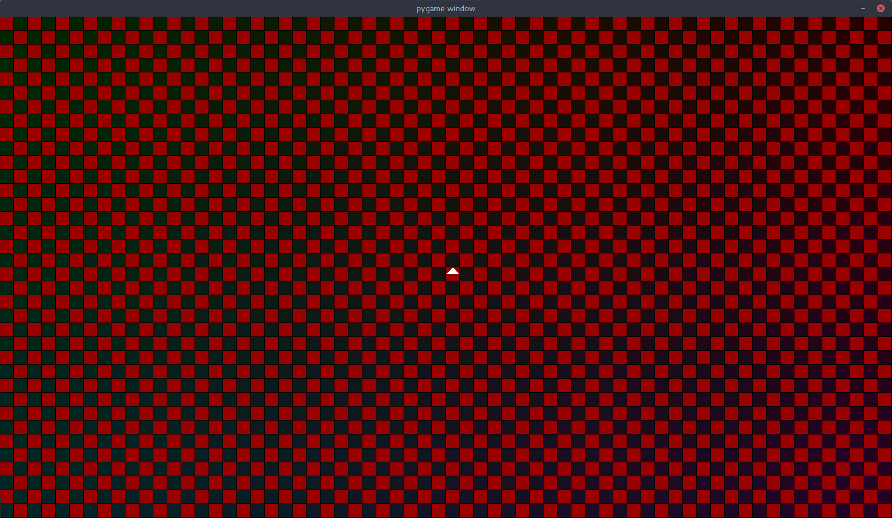

# Langton's Ant Simulator

## install dependencies:

this python program needs pygame and PyOpenGL for the displaying stuff.

this can be done via pip (on ubuntu-linux pip3 for using python 3):

```
pip install PyOpenGL PyOpenGL_accelerate pygame
```

##  run the program:

```
usage: Main.py [-h] [--steps STEPS] [--w W] [--h H] [--calc CALC]
               [--fullscreen] [--window_w WIN_W] [--window_h WIN_H]
               [--configurator] [--code CODE] [--file FILE]
               [--pattern PATTERN]

langton's ant simulation tool

optional arguments:
  -h, --help         show this help message and exit
  --steps STEPS      steps per second
  --w W              field width
  --h H              field height
  --calc CALC        calculate steps and only display result
  --fullscreen
  --window_w WIN_W   window width
  --window_h WIN_H   window height
  --configurator     start in field edit mode
  --code CODE        binary code for the ant ('10' corresponds to the starndard ant behaviour). 1 means 'turn left', 0 means 'turn right'
  --file FILE        writing number of living cells per step in this file
  --pattern PATTERN  initial pattern for the field. Possible values:
                     	 * 0: all fields inactive
                     	 * 1: all fields active
                     	 * check: checkboard pattern
                     	 * horizontal: horizontal stripes
                     	 * vertical: vertical stripes
                     	 * random: random values
```

*   if no arguments are given, the program will ask the user at the runtime for the requested arguments.

## keys

| key                    | function                                 |
| ---------------------- | ---------------------------------------- |
| return                 | enter/leave configuration mode           |
| arrow keys             | move langton's ant (in configuration mode) |
| space                  | activate field or switch field's color (in configuration mode) |
| backspace              | deactivate field (in configuration mode) |
| ctrl left / ctrl right | rotate ant (in configuration mode)       |
| escape                 | exit program                             |

## patterns:

| pattern name | with standard ant    | with multicolor ant  |
| ------------ | -------------------- | -------------------- |
| 0            |      |      |
| 1            |      |      |
| check        |  |  |
| horizontal   |      |      |
| vertical     |      |      |


## examples

*   run standard langton's ant and write number of living cells per timestep to 'out.txt':

    ```
    ./Main.py --file out.txt 
    ```

*   run standard langton's and with checkboard pattern:

    ```
    ./Main.py --pattern check
    ```

*   run on a fieldsize of 16x9 and start in configuration mode to adjust the ant's position and rotation:

    ```
    ./Main.py --w 16 --h 9 --configurator
    ```

*   run the multicolored ant 'RRLLLRLLLRRR' on a field with size 320x180 and perform 1000 steps per second:

    ```
    ./Main.py --w 320 --h 180 --code 110001000111 --steps 1000
    ```

*   run the multicolored ant 'RRLLLRLLLRRR' on a field with size 320x180 and calculate the result after 10.000 steps

    ```
    ./Main.py --w 320 --h 180 --code 110001000111 --calc 100000
    ```

    *   result:

        

